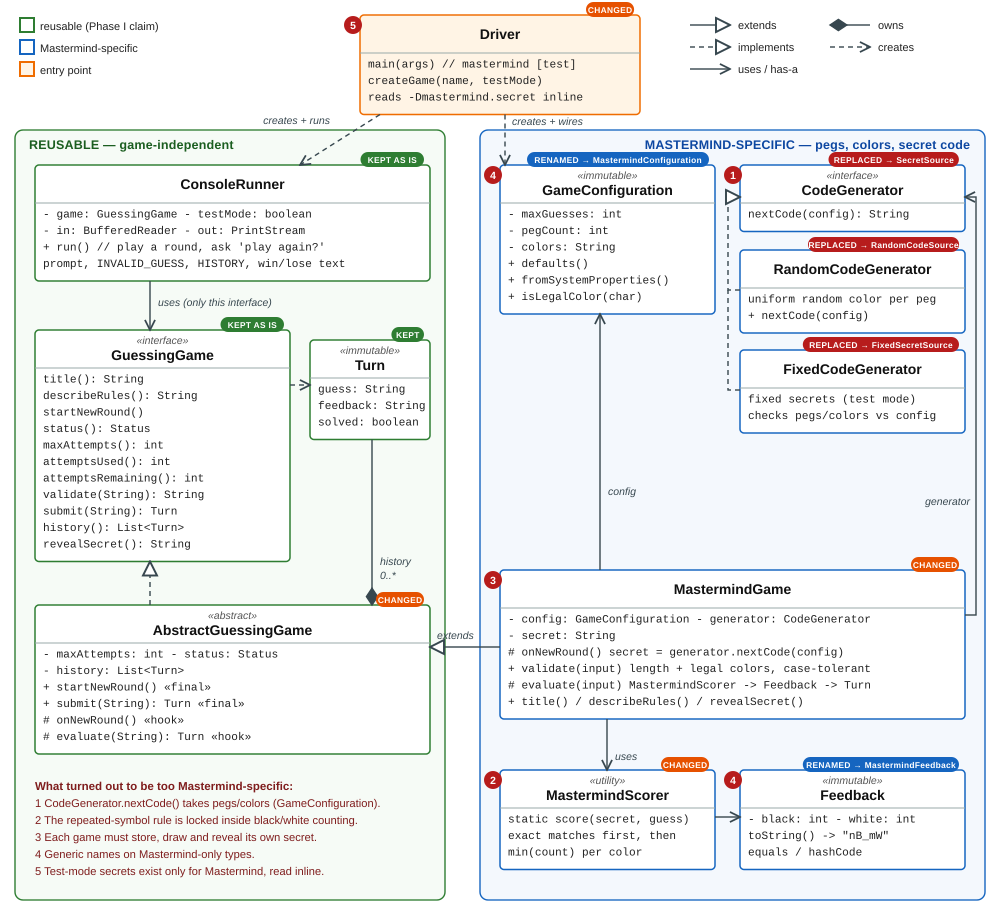
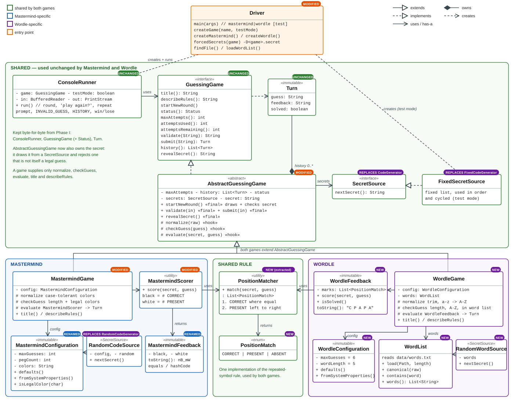

# Architecture Change: Adding Wordle to the Phase I Design

ECE 422C Assignment #2, Phase II · package `assignment2` · EID ak54582

Phase II starts from my submitted Phase I code (`Project2_Phase1_ak54582.zip`). Both games now run from the same program:

```
java assignment2.Driver mastermind [test]
java assignment2.Driver wordle [test]
```

**Summary of the change**

| | Count | Types |
|---|---|---|
| Phase I types reused unchanged | 4 | `GuessingGame`, `GuessingGame.Status`, `ConsoleRunner`, `Turn` |
| Phase I types modified | 4 | `AbstractGuessingGame`, `MastermindGame`, `MastermindScorer`, `Driver` |
| Phase I types renamed (body unchanged) | 2 | `GameConfiguration` → `MastermindConfiguration`, `Feedback` → `MastermindFeedback` |
| Phase I types replaced | 3 | `CodeGenerator` → `SecretSource`, `FixedCodeGenerator` → `FixedSecretSource`, `RandomCodeGenerator` → `RandomCodeSource` |
| New shared types | 2 + replacements | `PositionMatcher`, `PositionMatch` (plus `SecretSource`, `FixedSecretSource`) |
| New Wordle-specific types | 5 | `WordleGame`, `WordleConfiguration`, `WordleFeedback`, `WordList`, `RandomWordSource` |
| External data | 1 file | `data/words.txt` (2,271 five-letter words) |

Mastermind still behaves exactly as in Phase I. All 80 Phase I checks still pass, and two full console sessions are compared character for character with output captured from the Phase I build. The whole suite runs 220 checks (91 Mastermind, 129 Wordle) and all pass.

---

## Who decided what

The assignment asks me to separate my own decisions from AI suggestions I accepted. The Phase II code was written with Claude Code (Anthropic, model Claude Opus 5.5), working from my Phase I code and Phase I design documents at my request. In the table, **Mine (Phase I)** marks a decision I made and documented in Phase I that Phase II keeps or carries out. **AI (Phase II)** marks a design choice the AI proposed and implemented, which I accepted.

| # | Decision | Origin |
|---|---|---|
| D1 | The console loop talks only to the `GuessingGame` interface, so `ConsoleRunner` never sees game-specific types | Mine (Phase I) |
| D2 | `Turn` stores feedback as text, so it carries no game-specific types | Mine (Phase I) |
| D3 | Template method: `submit()` and `startNewRound()` are `final` in `AbstractGuessingGame` | Mine (Phase I) |
| D4 | A newly constructed game is ready to play; the runner starts a new round only between rounds | Mine (Phase I) |
| D5 | When a second game arrives, make the secret strategy game-independent (Phase I Design.pdf: "that is the first refactor I would make") | Mine (Phase I plan) |
| D6 | Shape of that refactor: a non-generic `SecretSource { String nextSecret(); }`, with sources that do not validate anything | AI (Phase II) |
| D7 | Move the secret's life cycle into `AbstractGuessingGame`; a secret must pass the same check as a guess | AI (Phase II) |
| D8 | Extract the repeated-symbol rule from `MastermindScorer` into a shared `PositionMatcher` used by both games (this reverses a position I took in Phase I) | AI (Phase II) |
| D9 | Rename `GameConfiguration` and `Feedback` to Mastermind-specific names | AI (Phase II) |
| D10 | Leave `ConsoleRunner`, `GuessingGame` and `Turn` untouched; both games print `Result: ...` | AI (Phase II) |
| D11 | One testing-mode convention for every game: `-D<game>.secret` or `<GAME>_SECRET`, with every entry checked at startup | AI (Phase II) |
| D12 | Word list format (skip `#` lines and invalid entries) and looking for it in parent folders. Keeping it as an external file is an assignment rule. | AI (Phase II) |
| D13 | No generic types (`GuessingGame<F>`, `Turn<F>`, `SecretSource<S>`) | AI (Phase II), following my Phase I reasoning for not making `CodeGenerator` generic |
| D14 | Numeric `-D` settings keep `Integer.getInteger` semantics in Wordle too (in Phase I I rejected the AI's stricter parsing) | Mine (Phase I); the AI followed it |
| D15 | Regression-test Mastermind against transcripts captured from the Phase I build | AI (Phase II) |

---

## 1. Which Phase I classes/interfaces were reused unchanged?

These files are byte-for-byte identical to Phase I (checked with `cmp`):

- **`GuessingGame`**, including the nested **`Status`** enum. The contract was already game-neutral: guesses, secrets and feedback are strings. Wordle needed no new method.
- **`ConsoleRunner`**. Wordle uses the same banner, "Guess k of N" prompt, `INVALID_GUESS:` reporting, case-insensitive `HISTORY`, win/loss messages and play-again loop, with no Wordle-specific code. This is the clearest evidence that the Phase I seam was in the right place.
- **`Turn`**. "Guess text + feedback text + solved?" describes a Wordle turn (`ALLEY`, `C P A P A`, `false`) as well as a Mastermind turn.

`MastermindConfiguration` and `MastermindFeedback` also have unchanged bodies, but they were renamed, so I count them as modified (Question 2).

## 2. Which Phase I classes/interfaces were modified? Why was each change necessary?

| Phase I type | Change | Why it was necessary |
|---|---|---|
| `AbstractGuessingGame` | Takes a `SecretSource` and now owns the secret. `startNewRound()` draws the secret, normalizes it and rejects it unless it is a legal guess. `validate()` and `revealSecret()` became `final`. The hooks changed from `onNewRound()` + `evaluate(input)` to `normalize(raw)` + `checkGuess(guess)` + `evaluate(secret, guess)`. | With two games, both would have repeated the same secret code: a field, drawing on each round, revealing it, and (new) checking a fixed test secret. That check used to live in `FixedCodeGenerator`, which can no longer do it because it no longer knows the rules (see `CodeGenerator` below). Putting it in the base class writes it once for every game. |
| `MastermindGame` | Lost its `secret` field, `onNewRound()`, `revealSecret()` and the null/normalize lines in `validate()`. Now implements `normalize`, `checkGuess` and `evaluate(secret, guess)`. Rules, messages and output are identical (105 → 88 lines). | Follows from the base-class change. |
| `MastermindScorer` | Same signature (`score(secret, guess)` returns black/white). The body now counts the results of the shared `PositionMatcher` instead of doing its own matching (48 → 30 lines). | Wordle's repeated-letter rule ("CORRECT matches are assigned before PRESENT; a secret letter can satisfy only one guessed letter") is the same rule Mastermind uses for repeated colors. One implementation is better than two copies of the trickiest code in the project. |
| `Driver` | Adds `wordle`; one small factory method per game; shared `forcedSecrets(game)` for `-D<game>.secret` / `<GAME>_SECRET`; every forced secret checked at startup; word-file loading and lookup; `Locale.ROOT` for the game name. | Both games must launch from the same program, and testing mode must work for both. In Phase I the test-secret logic was written inline for Mastermind only. |
| `GameConfiguration` → `MastermindConfiguration` | Rename only. | Next to `WordleConfiguration`, a type called `GameConfiguration` suggests it is shared, but it only knows about pegs and colors. |
| `Feedback` → `MastermindFeedback` | Rename only. | Same reason, now that `WordleFeedback` exists. |
| `CodeGenerator` → `SecretSource` | `String nextCode(GameConfiguration)` became `String nextSecret()`. Each source is given what it needs in its constructor. | The old signature required a Mastermind configuration, so no Wordle source could implement it. |
| `FixedCodeGenerator` → `FixedSecretSource` | Same list-in-order-then-cycle behavior, but no longer checks pegs and colors. | Checking moved to the game, which is the only place that knows what a legal secret is. |
| `RandomCodeGenerator` → `RandomCodeSource` | Same algorithm; receives its configuration in the constructor. | It now implements `SecretSource`. |

**Visible effects on Mastermind.** Normal play produces exactly the Phase I output. Three edge cases in testing mode changed, all on purpose:
1. A fixed secret is normalized like a guess, so `-Dmastermind.secret=bgop` now works as `BGOP`. Phase I rejected it.
2. A bad *later* test secret (`BGOP,BGOX`) is now reported at startup. In Phase I it surfaced as a stack trace when the player chose to play again.
3. An empty entry (`BGOP,,RRRR`) is rejected at startup instead of crashing in round 2.

## 3. Which new types are Wordle-specific?

| Type | Responsibility |
|---|---|
| `WordleGame` | Wordle's rules only: a legal guess has the configured length, uses only letters A–Z and is in the word list; scoring goes through `WordleFeedback`; rules text. 74 lines. |
| `WordleConfiguration` | Immutable settings: 6 guesses and 5 letters by default, overridable with `-Dwordle.guesses` and `-Dwordle.length`. |
| `WordleFeedback` | One `PositionMatch` per letter, printed as `C P A P A`; `isSolved()`. |
| `WordList` | Loads the external dictionary (UTF-8, byte-order mark ignored, `#` comments, invalid entries skipped); fast lookup; `canonical()` (trim, a–z → A–Z, never changes the length). |
| `RandomWordSource` | Normal play: a uniformly random word from the list. Accepts a seeded `Random`. |
| `data/words.txt` | Data, not code: 2,271 common five-letter words. Every word is both an allowed guess and a possible secret. |

Wordle needed **no** console loop, history, attempt counting, win/loss tracking, invalid-guess handling, testing-mode code, fixed secret source or matching algorithm of its own. All of those come from the shared layer.

## 4. Which Phase I abstractions turned out to be too Mastermind-specific?

1. **`CodeGenerator` and its implementations.** The idea (swap random for fixed secrets in testing mode) was general, but `nextCode(GameConfiguration)` tied it to pegs and colors, and `FixedCodeGenerator` checked codes against the color set. My Phase I design predicted this one.
2. **`MastermindScorer`.** The repeated-symbol rule was general, but it was locked inside a function that returns only black/white counts. In Phase I I wrote that generalizing it "would make the one tricky algorithm harder to read and test, with nothing gained". That was right for one game and wrong for two, because Wordle's specification uses the same rule.
3. **`AbstractGuessingGame`'s hooks.** `onNewRound()` left each game to store, draw and reveal its own secret. That was harmless with one game; with two it would have meant duplicate code.
4. **The names `GameConfiguration` and `Feedback`.** Generic names on types whose content is entirely Mastermind.
5. **`Driver.createGame`.** It read `mastermind.secret` inline, so testing mode existed only for Mastermind.

What was *not* too specific: `GuessingGame`, `ConsoleRunner` and `Turn`. Storing feedback as a `String` in `Turn` is what let Wordle reuse history and the console unchanged.

## 5. A refactoring that improved reuse or separation of concerns

### Extracting the shared matching rule (`PositionMatcher`)

Before, in Phase I, the rule was locked inside Mastermind's counting:

```java
// MastermindScorer.score, Phase I (excerpt)
for (int i = 0; i < secret.length(); i++) {
    char s = secret.charAt(i);
    char g = guess.charAt(i);
    if (s == g) {
        black++;
    } else {
        secretLeft.merge(s, 1, Integer::sum);
        guessLeft.merge(g, 1, Integer::sum);
    }
}
int white = 0;
for (Map.Entry<Character, Integer> e : guessLeft.entrySet()) {
    Integer inSecret = secretLeft.get(e.getKey());
    if (inSecret != null) {
        white += Math.min(inSecret, e.getValue());
    }
}
return new Feedback(black, white);
```

After, one shared function produces one result per position. Mastermind counts the results, and Wordle prints them:

```java
// PositionMatcher.match, Phase II (excerpt)
for (int i = 0; i < n; i++) {                     // pass 1: CORRECT first
    char s = secret.charAt(i);
    if (s == guess.charAt(i)) {
        result[i] = PositionMatch.CORRECT;
    } else {
        unclaimed.merge(s, 1, Integer::sum);
    }
}
for (int i = 0; i < n; i++) {                     // pass 2: PRESENT left to right
    if (result[i] != null) {
        continue;
    }
    char g = guess.charAt(i);
    Integer left = unclaimed.get(g);
    if (left != null && left > 0) {
        result[i] = PositionMatch.PRESENT;        // claims one occurrence
        unclaimed.put(g, left - 1);
    } else {
        result[i] = PositionMatch.ABSENT;
    }
}

// MastermindScorer.score, Phase II: counts them, black = # CORRECT, white = # PRESENT
// WordleFeedback.score, Phase II:   new WordleFeedback(PositionMatcher.match(secret, guess))
```

Why it is better:
- The trickiest rule in either game, repeated letters, is written once. Wordle's version arrived **already tested**: Phase I's exhaustive check of every Mastermind secret against every guess (1,679,616 + 1,048,576 pairs, compared with an independent scorer) now exercises the shared code.
- Separation of concerns: matching is a pure function, and each game only decides how to *present* the result (`nB_mW` or `C P A P A`).
- It is verified, not just argued. The Phase I exhaustive tests pass unchanged, Wordle's per-position results are compared with a separately written reference over every pattern on small alphabets, and a planted-bug check showed that each of four deliberately wrong versions of the rule is caught (TESTS.pdf).

### Moving the secret's life cycle into `AbstractGuessingGame` (with `SecretSource`)

Responsibilities are now separated cleanly. A **source** only produces strings (`FixedSecretSource` and the two random sources). A **game** only says what a legal guess is. The **base class** enforces the rule that ties them together: a secret must itself be a legal guess, because a secret the player cannot type could never be won. `FixedSecretSource` is therefore one class serving both games, and neither game contains any secret-handling code.

## 6. Did any abstraction become more complicated solely to support both games? Was it worthwhile?

Yes, in three places:

- **`AbstractGuessingGame`** grew from 2 hooks to 3, gained a `SecretSource` dependency, and now holds the secret (68 → 105 lines). It also imposes a constraint: a game's secret must be a legal guess. That holds for both games, but a future Wordle with a separate "answers" list would have to keep answers inside the allowed list. **Worthwhile:** the alternative was the same secret code, and a new validation path, copied into every game. Each game class is now only its rules (`WordleGame` is 74 lines).
- **`PositionMatcher`** returns a result per position, but Mastermind needs only two counts, so Mastermind now builds a small list per score and throws the positions away. **Worthwhile:** it costs a little extra work per score (the full Mastermind suite, which makes millions of scoring calls, still runs in about 1.5 seconds), and it removes a second copy of the repeated-symbol rule.
- **`Driver`** grew from 72 to 160 lines: a factory per game, shared test-secret parsing, startup checking of every forced secret, and word-file lookup. **Worthwhile:** testing mode now behaves the same in both games and fails before play, not in the middle of a replay.

Complexity deliberately *not* added, because it would not have paid off:
- **Generic types** (`GuessingGame<F>`, `Turn<F>`, `SecretSource<S>`). Both games use strings for secrets and guesses, and the runner only prints feedback, so type parameters would appear everywhere and do nothing.
- **A shared configuration base class.** The only common setting is the attempt limit, and the base class already receives that as an `int`.
- **A game registry or plugin system.** With two games, a `switch` in `Driver` is clearer.
- **Changing `ConsoleRunner`'s `Result:` to `Feedback:`** to match the example in the assignment. It would have changed Mastermind's Phase I output for no functional gain; the C/P/A feedback format itself matches the specification exactly.

## 7. If I had known about Wordle before Phase I, what would I have designed differently?

- **`SecretSource` from day one**, as a plain `String nextSecret()`, with secret checking done by the game, not the source.
- **The secret's life cycle in the base class** instead of an `onNewRound()` hook that every game fills in the same way.
- **The matching rule as its own per-position function**, with Mastermind's black/white counts derived from it.
- **Game-specific names** (`MastermindConfiguration`, `MastermindFeedback`) from the start, keeping generic names for genuinely shared types.
- **A per-game testing-mode convention** (`-D<game>.secret`) in `Driver` instead of Mastermind-only code.
- **A shared test harness** (`TestSupport`) instead of helpers private to the Mastermind tests.

What I would keep exactly as it was: the `GuessingGame` interface, `ConsoleRunner` with injected input/output, `Turn` holding feedback as text, `validate()` returning a reason instead of throwing, `final` template methods, and "a constructed game is ready to play". Those decisions are why three of the core types survived Phase II unchanged.

## 8. Before-and-after class/interface diagrams

Colors: green = shared, blue = Mastermind-specific, purple = Wordle-specific, orange = entry point. In the PDF the two diagrams are on the following landscape pages so the member text stays readable; the SVG sources are `docs/diagram-before.svg` and `docs/diagram-after.svg`.

### Before: Phase I as submitted



The pills show what happened to each type in Phase II. The red numbers mark the five places listed in Question 4.

### After: Phase II



<!-- pdf:skip-start -->
Text version of the after diagram, for viewers that do not render the images:

```
Driver ──creates──> ConsoleRunner ──uses──> «interface» GuessingGame <··implements·· «abstract» AbstractGuessingGame
                                                                         │ owns history: Turn   │ uses: «interface» SecretSource
                                                                         │                      ├── FixedSecretSource      (shared)
                                                                         │                      ├── RandomCodeSource       (Mastermind)
                                                                         │                      └── RandomWordSource       (Wordle)
                                       ┌──────────────── extends ────────┴───────── extends ────────────────┐
                                MastermindGame                                                          WordleGame
                                 ├─ MastermindConfiguration                                              ├─ WordleConfiguration
                                 └─ MastermindScorer ─> MastermindFeedback                               ├─ WordList  (data/words.txt)
                                          │                                                              └─ WordleFeedback
                                          └──────────uses──> PositionMatcher ─> PositionMatch <──uses─────────┘
                                                             (shared repeated-symbol rule)
```
<!-- pdf:skip-end -->
